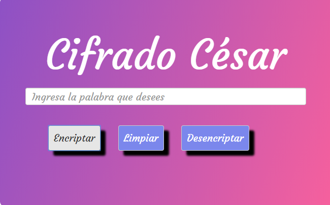

# Cifrado César

## Objetivo
Crea una web que por medio de un input se introduzca una frase y devuelva el mismo mensaje encriptado según el algoritmo de Cifrado César con el parámetro de desplazamiento de 33 espacios hacia la derecha.Asimismo debe de estar implementando en ECMAScript 6.

Por ejemplo:

- Texto original: ABCDEFGHIJKLMNOPQRSTUVWXYZ
- Texto codificado: HIJKLMNOPQRSTUVWXYZABCDEFG

## Tip
Mediante el video te explica el funcionamiento del algoritmo

## Métodos

Los siguientes métodos son utilizado para la implemtación de la web

- [Aprende más sobre `charCodeAt()`](https://developer.mozilla.org/es/docs/Web/JavaScript/Referencia/Objetos_globales/String/charCodeAt)
- [Aprende más sobre `String.fromCharCode()`](https://developer.mozilla.org/es/docs/Web/JavaScript/Referencia/Objetos_globales/String/fromCharCode)
- [Aprende más sobre `ASCII`](http://conceptodefinicion.de/ascii/)

## Resultado

1. El programa es capaz de cifrar y descifrar tanto letras
   mayúsculas como minúsculas. La fórmula para descifrar es: `(x - n) % 26`
2. El código está compuesto por 2 funciones con los siguientes nombres: `cipher` y `decipher`
3. El usuario no puede ingresar un campo vacío o que contenga números

## Fuentes
- [`ECMAScript 6`](https://carlosazaustre.es/ecmascript-6-el-nuevo-estandar-de-javascript/)
- [`Arrow Functions`](http://wesbos.com/arrow-functions-this-javascript/)
